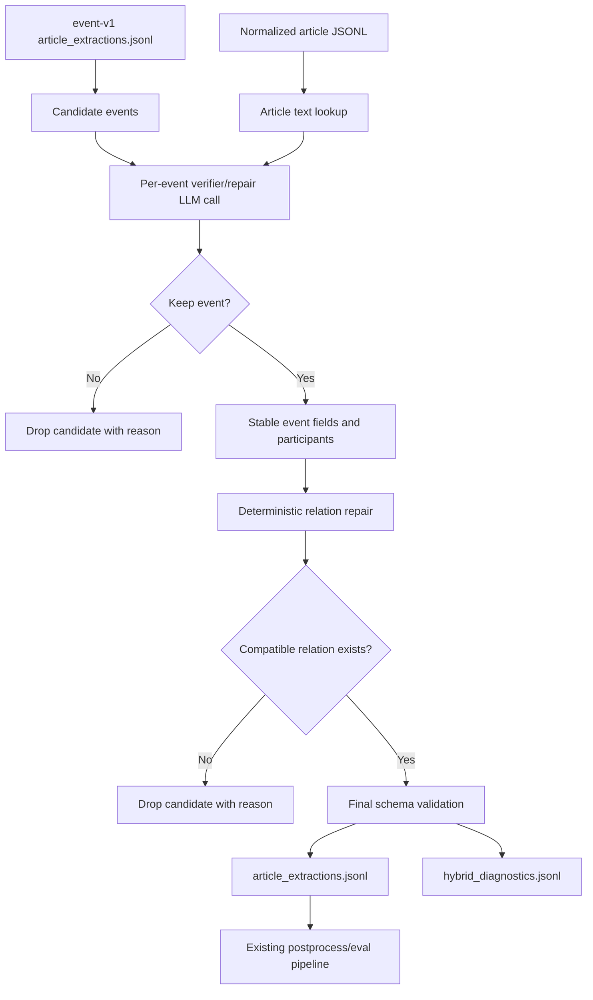

# Hybrid Event Extraction

GeoKG now uses `event-v1` as the baseline candidate generator for the next
quality experiment. The staged `event-v2-staged` design remains available for
reference, but it should not be the main direction as-is because the first
gold-set evaluation dropped too many events and participants.

The hybrid method keeps the strongest part of the current system: one-shot
article-level event extraction. It then adds a small correction layer where the
model verifies or repairs one candidate event at a time. Relation edges are
rebuilt deterministically only after the event and participants are stable.

## Pipeline



## Why This Direction

The staged extractor split one article into several model tasks: evidence
detection, classification, participant extraction, verification, and relation
building. That made debugging easier, but the evaluated result showed weak
candidate recall and unstable participant structure.

The hybrid extractor changes less at first:

- event detection stays with the strongest current extractor, `event-v1`;
- the model sees one complete candidate event and repairs it in one call;
- detection, classification, participants, and verification are not split into
  four separate LLM calls;
- relation repair is deterministic and runs after event fields and participants;
- diagnostics record verifier drops, deterministic relation drops, repairs, and
  validation warnings.

## Verifier Contract

For each event-v1 candidate, the verifier receives:

- article metadata;
- the exact candidate evidence;
- nearby article context;
- the event-v1 candidate event JSON.

It returns:

- `keep`;
- repaired `event_type`;
- repaired `event_date` and `date_precision`;
- repaired `location`;
- repaired `summary`;
- repaired `participants`;
- `confidence`;
- `repair_notes` or `drop_reason`.

The verifier must not return relation edges and must not change evidence.

## Deterministic Relation Repair

GeoKG maps event type to relation type after participants are stable:

- `AttackEvent`: `initiator -> target`, falling back to `affected_location` or
  `military_asset`;
- `ThreatEvent`: `initiator -> target`, falling back to `affected_location`;
- `BlockadeEvent`: `initiator -> affected_location`, falling back to `target`;
- `SupportEvent`: `supporter -> target`, falling back to `participant`;
- `SanctionEvent`: `sanctioning_actor -> target`, falling back to `participant`;
- `NegotiationEvent`: participant pairs as `NEGOTIATED_WITH`.

Before relation repair, GeoKG applies small deterministic role fixes for common
event-v1 patterns:

- `SupportEvent`: `initiator` becomes `supporter`;
- `SanctionEvent`: `initiator` becomes `sanctioning_actor`;
- `NegotiationEvent`: `initiator` and `target` become `participant`.

These fixes are intentionally narrow. If the verifier leaves an event without a
compatible source and target, the event is dropped and recorded in
`hybrid_diagnostics.jsonl`.

## Outputs

The hybrid extractor writes compatible final extraction artifacts:

```text
data/eval/<experiment>/extractions/article_extractions.jsonl
data/eval/<experiment>/extractions/failures.jsonl
data/eval/<experiment>/extractions/hybrid_diagnostics.jsonl
```

Each output record includes:

- `prompt_version: "event-v2-hybrid"`;
- `candidate_prompt_version`;
- `candidate_model`;
- `extraction_method: "hybrid_event_v1_verifier"`;
- `stages`.

## Run On LeanBabel

Run only the curated gold articles:

```bash
rm -rf data/eval/event-v2-hybrid/extractions

make eval-extract-gold-hybrid-leanbabel \
  OLLAMA_MODEL=gpt-oss:120b \
  EVAL_EXPERIMENT_NAME=event-v2-hybrid
```

This uses:

```text
data/extractions_event_v1/article_extractions.jsonl
```

as candidate input by default. Override it with `HYBRID_CANDIDATES=...` if you
want to test another one-shot candidate source.

Then postprocess, score, analyze, and log:

```bash
make eval-experiment-from-extractions \
  PYTHON=/dcs/large/u5728153/envs/promptgraph_vllm/bin/python3.11 \
  EVAL_EXPERIMENT_NAME=event-v2-hybrid \
  EVAL_EXPERIMENT_LOG_LABEL="event-v2-hybrid LeanBabel" \
  EVAL_EXPERIMENT_LOG_NOTES="event-v1 candidates with per-event verifier and deterministic relation repair"
```

Build manual gold-vs-hybrid review packets:

```bash
make eval-case-review-experiment \
  EVAL_EXPERIMENT_NAME=event-v2-hybrid
```

Review starts at:

```text
data/eval/event-v2-hybrid/case_review/index.md
```

For spreadsheet-style review, edit:

```text
data/eval/event-v2-hybrid/case_review/case_review.csv
```

Use `review_decision` values such as `gold_correct`, `hybrid_better`,
`merge_needed`, `both_wrong`, or `uncertain`.

If you reviewed the workbook form, apply those decisions and rescore:

```bash
make eval-reviewed-experiment \
  EVAL_EXPERIMENT_NAME=event-v2-hybrid
```

This writes the adjudicated gold file:

```text
data/gold/event_mentions.hybrid_reviewed.gold.jsonl
```

The adjudication summary is saved at:

```text
data/eval/event-v2-hybrid/case_review/adjudication_summary.json
```

If Ollama is already running locally:

```bash
make eval-hybrid-experiment \
  EVAL_EXPERIMENT_NAME=event-v2-hybrid \
  OLLAMA_MODEL=gpt-oss:120b
```

## How To Interpret Results

Compare `event-v2-hybrid` with the logged `event-v1` baseline before changing
the prompt again.

- If recall falls: verifier is too strict or deterministic relation repair is
  dropping too many events.
- If precision falls: verifier is keeping weak event-v1 candidates.
- If participant F1 improves but event F1 does not: relation repair or date
  repair is still wrong.
- If relation F1 improves but participant F1 falls: deterministic role repair is
  too aggressive.
- If evidence scores fall: the verifier is not the issue, because evidence is
  copied from the candidate; inspect candidate source quality.

Change one component per experiment and append each score to
`EVALUATION_LOG.md`.
