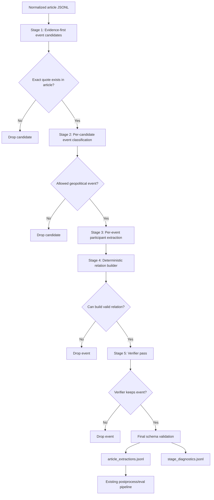

# Multi-Stage Event Extraction

Status: this method is available for reference, but it is not the recommended
next direction as-is. The first curated gold-set run showed that full staging
dropped too many events and produced weak participant structure. Use
`docs/HYBRID_EXTRACTION.md` for the current recommended experiment, which keeps
`event-v1` as the candidate generator and adds one per-event verifier/repair
pass.

GeoKG now supports a staged extraction path alongside the original one-shot
extractor. The staged path is designed for evaluation experiments where the
one-shot prompt is too unstable: it asks the model to solve smaller tasks and
uses deterministic code for relation construction.

## Why Change The Method

The `event-v1.1` and `event-v1.2` prompt experiments showed that prompt-only
changes create tradeoffs:

- stricter role guidance improved some dates but dropped too many events;
- relaxed guidance recovered recall but reduced evidence quality;
- one bad evidence field could distort the whole article output;
- participant and event-relation errors dominate the report.

The staged method addresses this by separating event detection, classification,
participant extraction, relation construction, and verification.

## Pipeline



## Stages

### Stage 1: Evidence Candidates

The model only identifies event-candidate evidence. It must return exact
contiguous article quotes. Candidates with non-exact evidence are dropped before
later stages.

Output intent:

- `candidate_id`
- `event_type_hint`
- `evidence`
- `context`
- `rationale`

### Stage 2: Event Classification

Each candidate is classified independently. This stage decides whether the
candidate is an allowed geopolitical event and assigns:

- event type;
- event date;
- date precision;
- location;
- summary;
- confidence.

### Stage 3: Participants

The model extracts participants only for one event at a time, using the candidate
quote, nearby context, and classification result. This reduces full-article
cross-contamination.

### Stage 4: Deterministic Relations

GeoKG code builds relation edges from event type and participant roles. This is
deliberate: relation type is already implied by event type, so the model should
not need to invent relation edges.

Examples:

- `AttackEvent`: `initiator -> target/affected_location` as `ATTACKED`
- `ThreatEvent`: `initiator -> target/affected_location` as `THREATENED`
- `NegotiationEvent`: participant pairs as `NEGOTIATED_WITH`
- `SupportEvent`: `supporter -> target/participant` as `SUPPORTED`
- `SanctionEvent`: `sanctioning_actor -> target` as `SANCTIONED`
- `BlockadeEvent`: `initiator -> affected_location/target` as `BLOCKADED`

### Stage 5: Verifier

The verifier checks the drafted event against the exact quote and nearby context.
It can drop unsupported or out-of-scope events and correct the classification,
participants, date, location, and summary. It does not change the evidence quote.

## Outputs

The staged extractor writes compatible final extraction artifacts:

```text
data/eval/<experiment>/extractions/article_extractions.jsonl
data/eval/<experiment>/extractions/failures.jsonl
data/eval/<experiment>/extractions/stage_diagnostics.jsonl
```

`article_extractions.jsonl` has the same shape consumed by existing
postprocessing and evaluation code. Each record includes:

- `prompt_version: "event-v2-staged"`
- `extraction_method: "multi_stage"`
- `stages`

`stage_diagnostics.jsonl` records candidate counts, final event counts, dropped
candidate reasons, and validation warnings. Use it with the error analysis
report to decide which stage needs improvement.

## Run On LeanBabel

Run only the curated gold articles:

```bash
rm -rf data/eval/event-v2-staged/extractions

make eval-extract-gold-staged-leanbabel \
  OLLAMA_MODEL=gpt-oss:120b \
  EVAL_EXPERIMENT_NAME=event-v2-staged
```

Then postprocess, score, analyze, and log:

```bash
make eval-experiment-from-extractions \
  PYTHON=/dcs/large/u5728153/envs/promptgraph_vllm/bin/python3.11 \
  EVAL_EXPERIMENT_NAME=event-v2-staged \
  EVAL_EXPERIMENT_LOG_LABEL="event-v2-staged LeanBabel" \
  EVAL_EXPERIMENT_LOG_NOTES="evidence-first staged extraction with deterministic relations"
```

## Iteration Plan

Use evaluation results to decide where to change the method:

- Many missed events: improve Stage 1 candidate recall.
- Many extra events: strengthen Stage 5 verifier/drop rules.
- Evidence mismatch: adjust Stage 1 to prefer shorter minimal quotes.
- Participant errors: improve Stage 3 role-specific instructions or add role
  normalization rules.
- Event relation errors: inspect deterministic relation rules before changing
  model prompts.
- Date errors: improve Stage 2 date instructions.

Do not tune all stages at once. Change one stage, rerun the gold-set experiment,
and compare `EVALUATION_LOG.md`.
